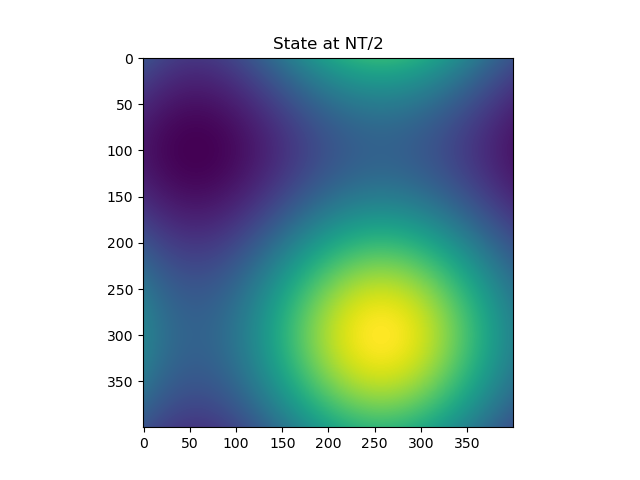
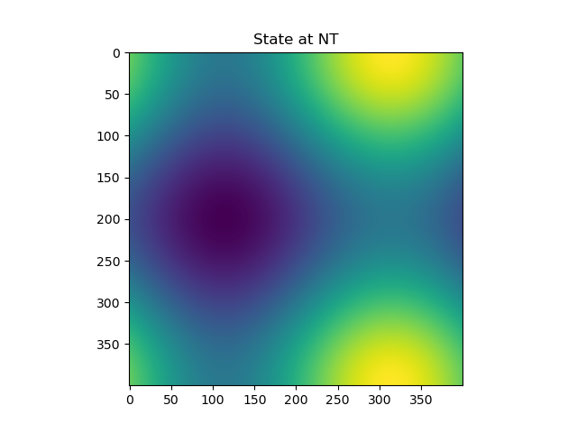

# Project 1

The project replicates the pseudo code for implementing serial advection using Lax Method
The code creates graphs at 3 different time stamps for the FTCS equation
The outputs from the code for Initial timestamp, At NT/2 timestamp and NT timestamp are stored in output, output2 and output3 files respectively
The respective graphs for the output files are stored in output.png, output2.png and output3.png
Below are the images at the three timestamps mentioned above:

