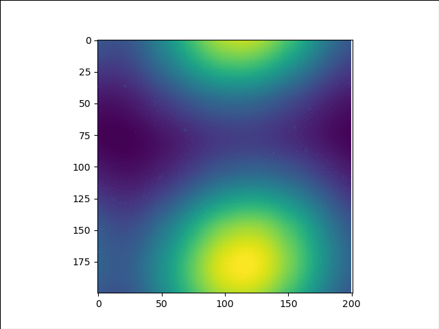

# Advection

### Parallel

The command for running the OMP code is:  
./Advection_OMP 1600 400 1 1.0e3 5.0e-7 2.85e-7 4 1  

Here the arguments are as follows:  
N  
NT  
L  
T  
u  
v  
nt (Number of threads)  
method (1 for Lax, 2 for first order method, 3 for second order method)  

The value of grind rate = 10000 ^ 2 * 20000 / 2000.89 = 0.99B  

The plot for strong scaling when N = 3200 is given below:  

|Threads | 1 | 2 | 4 | 8 | 16 | 32 | 64 | 128| 
|:---:|:---:|:---:|:---:|:---:|:---:|:---:|:---:|:---:|
|Time (s) | 62.8 | 33.02 | 16.8  |8.82 | 4.79 | 4.47 | 2.86 | 2.88 |
|Speed up | 1.00 | 1.90  |3.74  |7.12  |13.11|  14.05 | 21.96 | 21.81|

The plot for strong scaling when N=200 is given below:

|Threads | 1 | 2 | 4 | 8 | 16 | 32 | 64 | 128| 
|:---:|:---:|:---:|:---:|:---:|:---:|:---:|:---:|:---:|
|Time (s) | 0.28 | 0.17 | 0.1  |0.07 | 0.056 | 0.041 | 0.22 | 0.31| 
|Speed up | 1.00 | 1.65 | 2.80 | 4.00|  5.00 | 6.83  |1.27  |0.90|

The plot for weak scaling is given below:

### Message Passing Interface

In the code, for the inputs, 0th rank is taking all the inputs and broadcasting it to the other ranks. 
All ranks are working on their small chunks and at the end of the code, all the ranks are sending 
data to 0th rank for it to print to the file. In addition to this, parallelization has also been added to 
cater to for loops for each time stamp.  

Sample code for executing the file –   
 
mpicc -fopenmp -DPARALLEL -o Advection_MPI_OMP ./Advection_MPI_OMP.c -lm  
mpirun -np 4 ./Advection_MPI_OMP 100 20000 1 1e6 5e-7 2.85e-7 4 1  

Here, 4 after np denotes the number of processors.  
./test is the compiled file  
The parameters in the middle are in the same order as directed in the first milestone of the 
assignment  
The second last parameter is the number of parallel threads  
Last parameter is 1 for Lax method, 2 for first order and 3 is for second order.  

Below is the strong scaling graphs for 4 parallel threads and N = 10000. 

|Ranks | 1 | 4 | 16 |
|:---:|:---:|:---:|:---:|
|Log(Ranks) | 0 | 1 | 2 |
|Time (s) | 5982.1 | 1489.2 | 491.7 |
|Strong Scaling | 1.0 | 4.0 | 12.2 |
|Log(Strong Scaling) | 0.0 | 1.0 | 1.8 |
|Grind Rate (B) | 0.3 | 1.3 | 4.1 |
 

Below is the weak scaling graph for 4 parallel threads for values of N mentioned in the table:  

|Ranks | 1 | 4 | 16 |
|:---:|:---:|:---:|:---:|
|Log(Ranks) | 0 | 1 | 2 |
|N | 4000 | 8000 | 16000 |
|Time (s) | 1524.5 | 1360.5 | 1460.0 |
|Sn | 1 | 0.9 | 1.0|

From 1 MPI Rank per core to no use of OpenMP, the time decreases by about 60%. For 4 parallel 
threads, the time taken for 1 MPI Rank per core is around 6k seconds, where as without OpenMP, 
its around 3.6k seconds. 
 
For the non uniform, I have taken u proportional to i and v proportional to j in our grid  

### Final Graphs

Below are the images at the three timestamps mentioned above:

